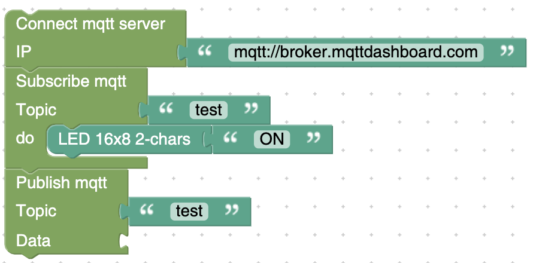

# Welcome to MQTT Plugin for KidBright!

**plugin สำหรับเชื่อมต่อกับ MQTT ภายใน KidBright**
การที่ทำให้อุปกรณ์ KidBright เชื่อมต่อไปยังช่องทางอื่นได้ไม่ว่าจะเป็น Hardware, Mobile App, Web ก็เป็นการปลดล็อคขีดจำกัดที่สำคัญสำหรับ kidbright

# วิธีติดตั้ง Plugin

เปิด **KidBrightIDE** และเลือก Menu ที่มีชื่อว่า Plugins และ เลือก **Install Plugin** แล้วกดเลือกไฟล์ mqtt.zip ที่ Download มาจากปุ่ม Download ข้างบน 
**KidBrightIDE** จะทำการ restart รอบนึง เมื่อเปิดขึ้นมาใหม่แล้วจะโชว์ Plugin ที่แถบด้านซ้ายมือ

## ตัวอย่างโปรแกรม

ถ้าหากบน LED ขึ้นคำว่า ON แปลว่าสามารถใช้งาน MQTT ได้สำเร็จ

## วิธีการใช้งาน

 

 - ใช้ block นี้เพื่อทำการเชื่อมต่อกับ MQTT
 (ตอนใส่ ip server ให้ใส่ **mqtt://** นำหน้าด้วย)

 - ใช้ block นี้เพื่อ subscribe ข้อมูลจาก topic **(รับข้อมูล)**
 
 - ใช้ block นี้เพื่อ public ข้อมูลไปที่ topic **(ส่งข้อมูล)**
 
 - ใช้ block นี้เพื่อดูข้อมูลที่ส่งมาจาก topic นั้นๆ **(ดูข้อมูล)**
 
 - ใช้ block นี้เพื่อเช็คว่าได้เชื่อมต่อ MQTT Server แล้วหรือยัง
 

